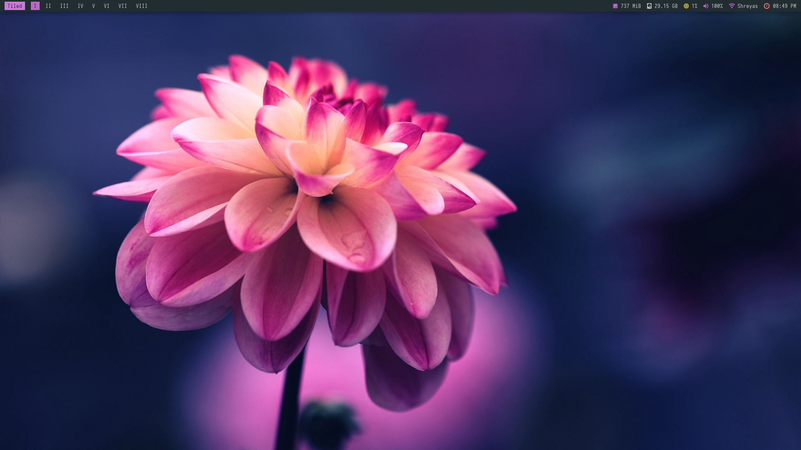
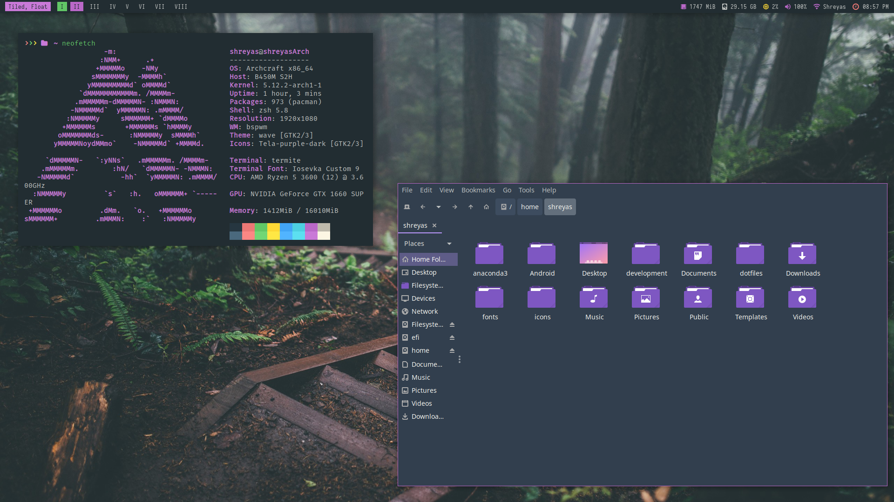
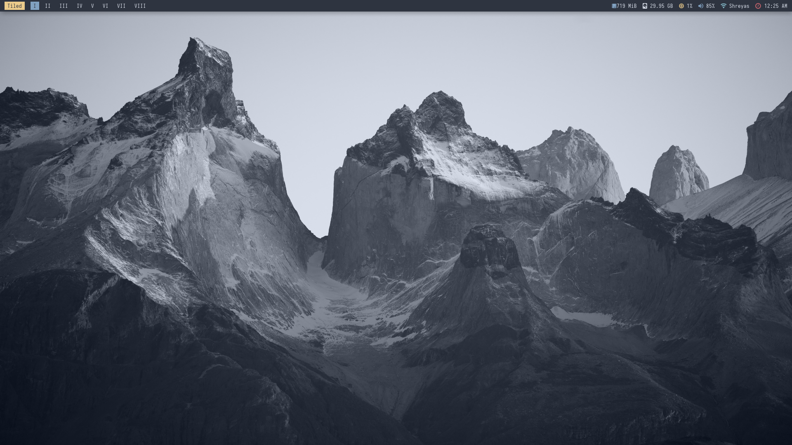
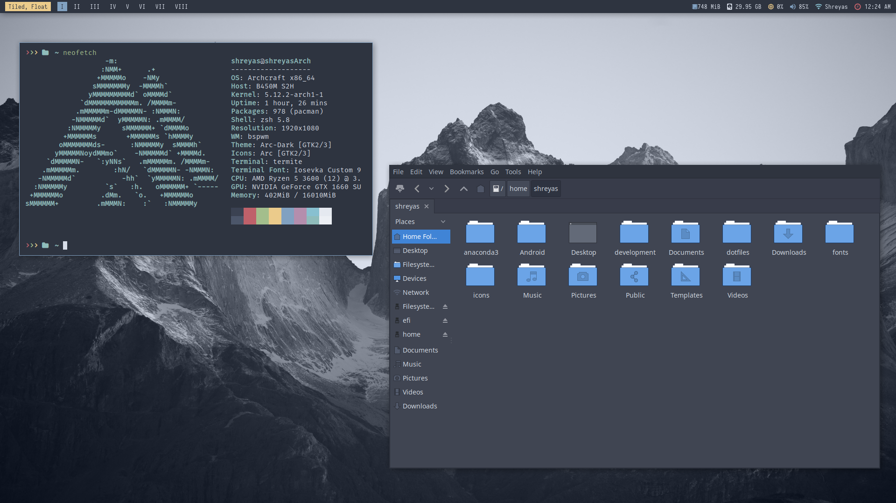
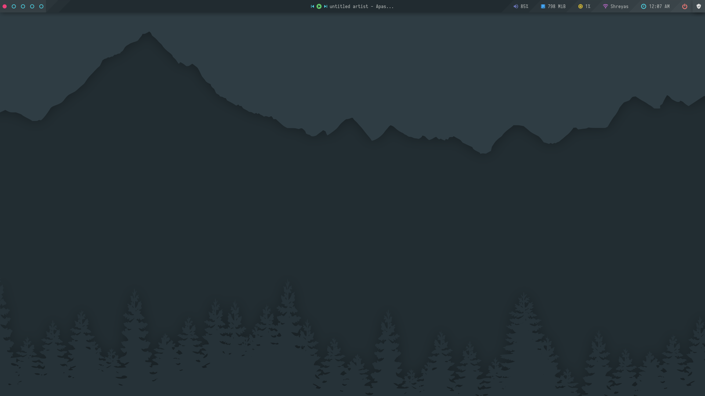
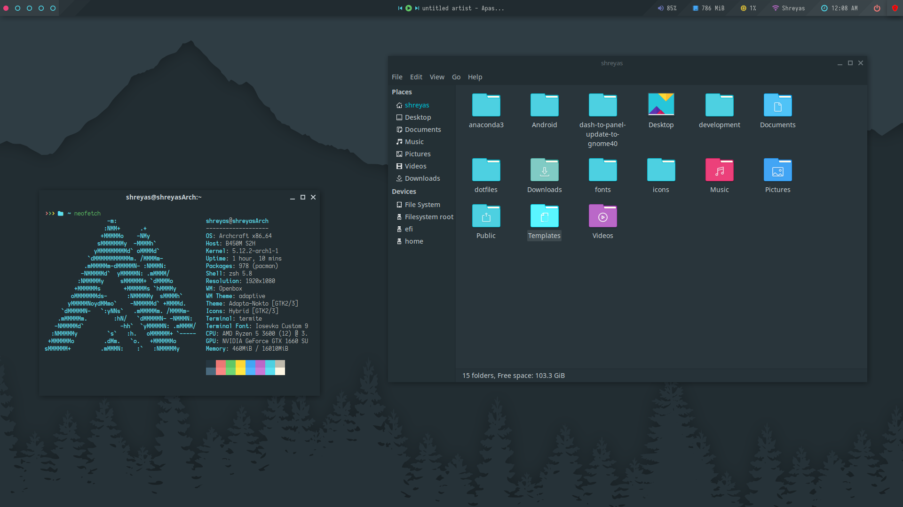
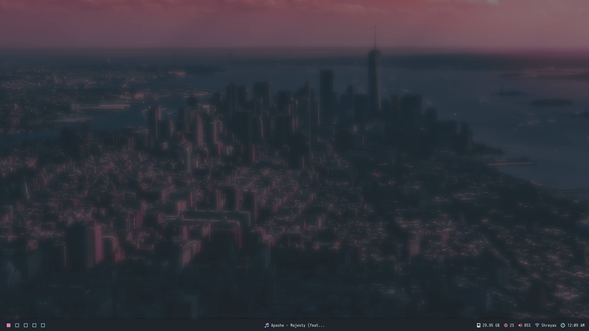
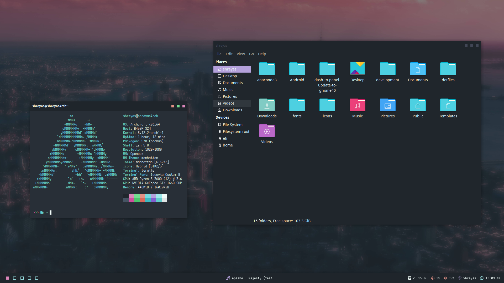
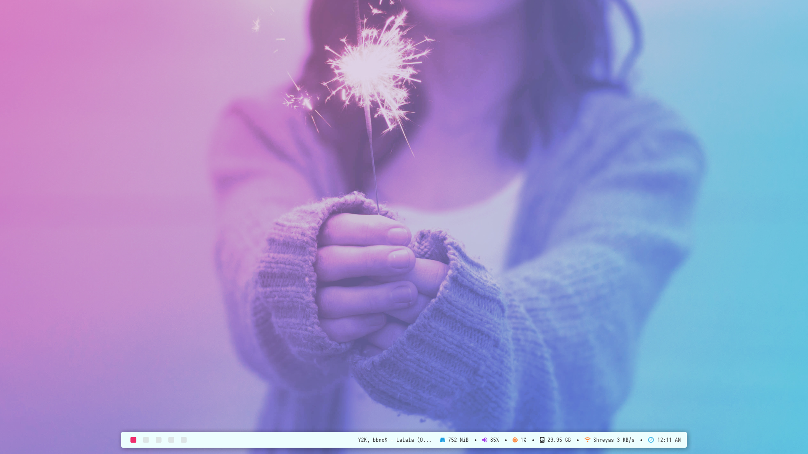
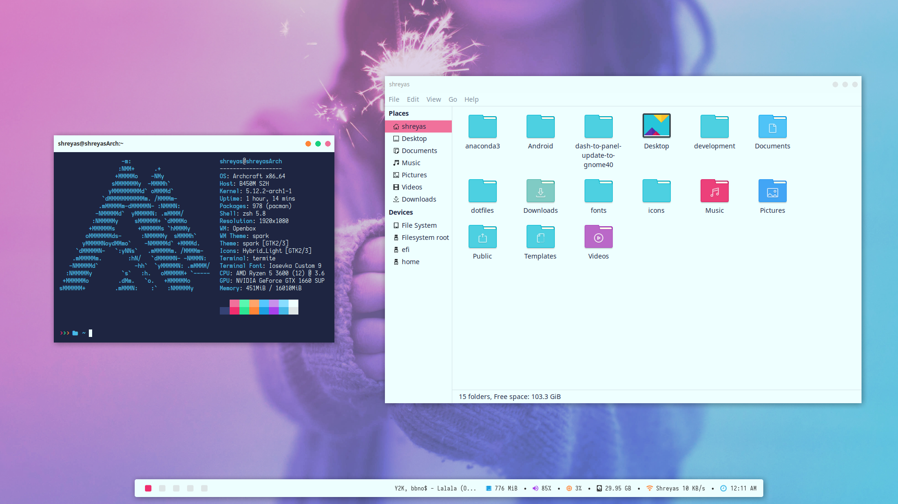

# My Dotfiles
This desktop is heavily inspired and created on [Archcraft](https://archcraft-os.github.io). Its a great minimal arch based distro with a gorgeous desktop. All credits go to the creator of that distro and I have just modified stuff on top of it to my liking. 

Do checkout https://github.com/adi1090x , he has contributed immensely to the Linux community.

## Screenshots

These are just a few screenshots of some of the possible themes. There are a lot more themes available and you can switch between them easily.

## BSPWM
   
   ### Dark
   
   
   
   
   
   ### Nord
   
   
   
   
   

## Openbox

   ### Default
   
   
   
   
   
   ### Manhattan

   
   
   
   
   ### Spark
   
   
   
   

## Steps to get my Desktop:

1) Install the following dependencies

   `yay -S Openbox BSPWM polybar rofi dunst mpd ncmpcpp dmenu geany obmenu-generator ranger termite compton zsh oh-my-zsh nitrogen lxappearance`

(If you use a different AUR helper like paru , please use it accordingly. I am using the AUR to install most of the packages as some of the patched packages are not available in the official repos)

2) Move Backgrounds folder to `/usr/share/backgrounds`

3) Move Themes folder to `/usr/share/themes`

4) Move icons folder to `/usr/share/icons`

5) Move `.mpd,.ncmpcpp,.Xresources.d,.Xresources,.zshrc` to your home directory

6) Copy the contents of the .config folder and paste them in `~/.config/`

7) Some of the fonts to install- Fira mono for powerline, Cascadia code, iosevka nerd font, Dejavu sans, Source code pro(Or copy the contents of the fonts folder and paste it in /usr/share/fonts)

8) Copy the contents of bin and paste them in `/usr/bin`

9) Copy the archlabs folder and paste it in `/usr/lib`

10) That's it! you should be good to go now. Reboot once just to be safe and login to your new system

## Tips

1) I have kept the keybindings common between both the BSPWM as well as openbox desktop to get a better experience. Do change them as per your requirements. 

   To change the keybindings on BSPWM and Openbox, edit the sxhkdrc file in `~/.config/sxhkd` and `~/.config/openbox/rc.xml` respectively.

2) You can change the themes on bspwm with the keybind Ctrl+Alt+T and you can use the Obmenu on openbox to do the same.

3) If for some reason you find the gtk-theme or icons not changing with change in global theme, open lxappearance either from rofi or from the terminal and change the theme accordingly.

4) The terminal application Termite has become obsolete now. I have not bothered changing the terminal application as its already well customized to my liking and I'm comfortable with it. If you would prefer another terminal application , install alacritty or kitty instead of termite

